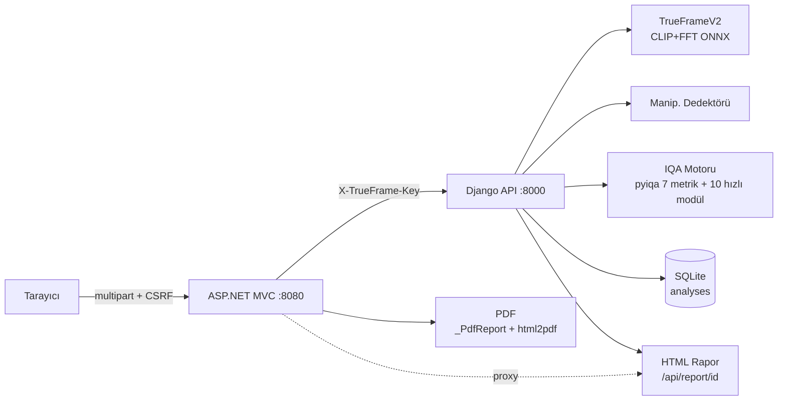
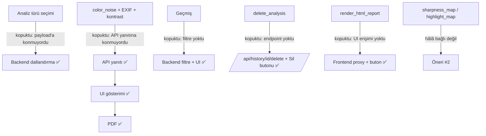

# TrueFrame — Tam Kod Denetimi Raporu
*Tarih: 10 Haziran 2026 · Denetim + uygulanan düzeltmeler*

---

## 1. Proje Haritası

```
Tarayıcı ──► ASP.NET Core MVC (frontend :8080)
                │  HTTP multipart + X-TrueFrame-Key
                ▼
            Django REST API (backend :8000, iç ağ)
                ├─► DetectionService  — TrueFrameV2 (CLIP+FFT, ONNX→PT→HF fallback)
                │                      + Manipülasyon dedektörü (deepfake_vs_real)
                ├─► IQA Motoru        — pyiqa 7 metrik + 10 hızlı (ML'siz) metrik modülü
                ├─► SQLite            — analyses tablosu (WAL, thumbnail, tam api_response)
                └─► HTML Rapor        — render_html_report() → /api/report/<id>
```

**Veri akışı (uçtan uca):** Upload.cshtml (form) → `AnalysisController.Result` (doğrulama, bellek, geçici dosya) → `POST /api/analyze` (API key, MIME sniffing, boyut/piksel limiti) → tespit ve/veya kalite → JSON yanıt → `_save_to_history` (thumbnail + tam yanıt SQLite'a) → `MapToViewModel` → Result.cshtml → (geçmiş) History/Details → PDF (`_PdfReport.cshtml` + html2pdf) / HTML rapor proxy.

### Özellik Durum Tablosu (denetim öncesi → sonrası)

| Özellik | Önce | Sonra |
|---|---|---|
| AI/sahte tespiti (5 kategori + manipülasyon) | Tam çalışıyor | Tam çalışıyor |
| Kalite analizi (7 IQA + 6D radar + profiller) | Çalışıyor, **çıktının bir kısmı kayboluyordu** | Tam, uçtan uca |
| Analiz türü seçimi (Real/Fake ⊕ Kalite) | **Kodda var, backend'e bağlı değil** — AI modeli her zaman çalışıyordu | Tam çalışıyor |
| PDF raporu | **Bozuk** — Türkçe karakterler kırık, alanların çoğu eksik | Tam: tüm alanlar, görsel, sayfalama |
| Geçmiş listesi | Çalışıyor, **filtresiz** | Filtreli (7 ölçüt) |
| Geçmiş filtresi | **Hiç yok** | Backend + UI tam |
| Kayıt silme (`delete_analysis`) | **Kodda var, hiç bağlı değil** | Endpoint + UI butonu |
| HTML rapor (`/api/report/<id>`) | **Kodda var, UI'dan erişilemiyor** | Frontend proxy + "HTML Rapor Aç" butonu |
| EXIF detayları (kamera, ISO, lens, diyafram…) | **Hesaplanıyor, API'ye konmuyor** | API + UI + PDF |
| Kroma gürültü analizi (`color_noise`) | **Hesaplanıyor, API'ye konmuyor** | API + UI + PDF |
| RMS kontrast, renk sıcaklığı etiketi | **Hesaplanıyor, dönmüyor** | API + UI + PDF |
| Keskinlik/highlight haritaları (`sharpness_map`, `highlight_map`) | Hesaplanıyor, hiçbir yerde kullanılmıyor | **Hâlâ bağlı değil** — öneri bölümünde (görsel overlay gerektirir) |
| Kalite profilleri (web/social/print/news) | Tam çalışıyor | Tam çalışıyor |
| Misafir modu (3 hak) | Çalışıyor (README "5" diyor — tutarsızlık) | Çalışıyor (not edildi) |
| TIFF/BMP desteği | Backend kabul ediyor, **Upload formu engelliyor** | `accept` hizalandı |

---

## 2. Kök Neden Analizleri + Uygulanan Düzeltmeler

### a) PDF rapor butonu düzgün PDF üretmiyordu
**Kök neden (3 katman):**
1. `Result.cshtml` ve `Details.cshtml` içindeki elle yazılmış jsPDF kodu `doc.text()` + yerleşik `helvetica` fontu kullanıyordu. Bu font **Türkçe karakter içermez** (ğ, ş, İ, ı, ö, ü, ç) → metinler bozuk basılıyordu.
2. PDF'e yalnızca AI skoru + 6D + IQA tablosu yazılıyordu; **görsel önizleme, pozlama, renk, geometri, EXIF, profil kontrolleri tamamen eksikti**.
3. Sabit yükseklikli `sectionBox(color, h)` kutuları içerik uzayınca taşıyor, sayfalama elle `if (y > 220)` kontrolleriyle kırılgandı.

**Düzeltme:** `frontend/Views/Shared/_PdfReport.cshtml` (yeni) — tüm alanları içeren gizli, beyaz-tema rapor DOM'u + `html2pdf.js` (html2canvas + jsPDF). Rasterleştirme Unicode sorununu kökten çözer; sayfalama `.pdf-block { page-break-inside: avoid }` ile, sayfa numaraları üretim sonrası jsPDF döngüsüyle basılır. İki sayfadaki ~260 satır kopyala-yapıştır jsPDF kodu silindi, tek ortak şablona bağlandı. PDF artık şunları içerir: başlık + rapor/analiz tarihi + dosya adı, görsel önizleme, teknik bilgi, AI skoru + manipülasyon, kalite skoru + verdict + 6D, pozlama (5 metrik + RMS kontrast), renk & kroma gürültüsü, geometri/blur/moire, EXIF, 7 IQA metriği, profil kontrol listesi.

### b) Kayıtlarım ekranında filtre yoktu
**Kök neden:** `db.get_history()` parametresiz `LIMIT 30` sorgusuydu; API ve UI'da filtre kavramı yoktu.
**Düzeltme:**
- `db.py get_history()` — 8 isteğe bağlı filtre (result/min_score/max_score/date_from/date_to/file_type/profile/search), tamamı parametrize SQL.
- `api_views.history_list` — sorgu parametrelerini beyaz listeyle doğrular (`VALID_RESULT_FILTERS`, tarih regex'i, limit 1–200).
- `AnalysisController.History` — parametreleri InvariantCulture ile backend'e taşır; `HistoryViewModel` filtre durumunu korur.
- `History.cshtml` — filtre formu (tespit sonucu, kalite skoru aralığı, tarih aralığı, dosya türü, ad arama) + "filtreye uyan kayıt yok" boş durumu + temizleme.

### c) Sadece kalite isteğinde AI modeli yine de çalışıyordu
**Kök neden:** `realFakeSelected/qualitySelected` checkboxları yalnızca **görünümü** kontrol ediyordu; `AnalysisController` bu bayrakları backend'e hiç göndermiyordu, `analyze()` koşulsuz `_service.predict_pil()` çağırıyordu.
**Düzeltme:** Frontend artık `analyze_ai` ve `analyze_quality` alanlarını multipart payload'a ekliyor; backend `_parse_bool` ile okuyup dallanıyor — yalnızca kalite seçiliyse **AI ve manipülasyon modeli hiç çağrılmaz** (CPU'da istek başına saniyeler + bellek tasarrufu). Yanıt `"analysis": {"ai":…, "quality":…}` bayraklarını içerir; Details sayfası kayıttaki bayraklara göre bölümleri gösterir. İkisi de kapalıysa eski davranış (ikisi de çalışır) korunur.

### d) Tüm kalite metrikleri kaydedilip gösterilmiyordu
**Kök neden:** `_run_quality()` analiz sonucundan seçici kopyalama yapıyordu; `color_noise` bloğu, EXIF detayları (kamera/lens/ISO/diyafram/enstantane/odak/flaş/GPS), `contrast_rms`, `temperature_label`, `cast_strength` hesaplandığı halde yanıta konmuyordu → DB'deki `api_response`'ta da yoktu → UI/PDF'te de görünemezdi.
**Düzeltme:** API yanıtı genişletildi → `AnalysisApiResponse.cs` DTO'ları (`ColorNoiseResponse` yeni, `ExifResponse`/`ExposureResponse`/`ColorResponse` genişletildi) → `AnalysisViewModel` + `MapToViewModel` → Result/Details görünümleri → PDF şablonu. Zincirin beş halkası da aynı şemayı kullanıyor.

---

## 3. Güvenlik ve Performans Bulguları

| # | Bulgu | Risk | Durum |
|---|---|---|---|
| S1 | **Geçmiş kayıtları kullanıcıya bağlı değildi** — tüm kayıtlı kullanıcılar ve misafir analizleri tek global listedeydi | **Yüksek** | ✅ **Düzeltildi (onaylı)** — `analyses` tablosuna `user` kolonu (geri uyumlu ALTER TABLE migration, mevcut veri korunur) + liste/detay/silme/rapor uçlarında kullanıcı süzgeci + frontend session kullanıcısını iletiyor. Misafir analizleri (`user='guest'`) hiçbir kayıtlı kullanıcının listesine düşmez; migration öncesi sahipsiz kayıtlar görünür kalır. |
| S2 | `report.py` HTML raporu kullanıcı kontrollü dosya adı/verdict'i **escape etmeden** gömüyordu → saklanan XSS | Yüksek | ✅ Düzeltildi (`html.escape` + güvenli dosya adı) |
| S3 | Piksel bombası: 5 MB'lık dosya limiti var ama küçük PNG devasa bitmap'e açılabiliyordu (OOM/DoS) | Orta | ✅ Düzeltildi (50 MP üst sınırı, model çağrısından önce) |
| S4 | `TRUEFRAME_API_KEY` boşsa doğrulama sessizce atlanıyor | Orta | ✅ İyileştirildi (startup'ta açık uyarı logu); compose üretimde key'i zorunlu kılıyor |
| S5 | API key karşılaştırması `==` ile (timing yan kanalı, iç ağda düşük olasılık) | Düşük | ✅ `hmac.compare_digest` |
| S6 | `users.json` içinde legacy SHA-256 hash ("ns" kullanıcısı) | Düşük | Mevcut mekanizma ilk girişte PBKDF2'ye otomatik yükseltiyor; dosya .gitignore'da |
| S7 | Misafir hakkı session'a yazılı — çerez silinince sıfırlanır | Düşük | Bilgi olarak not edildi (MVP kabulü) |
| S8 | `image_loader.load_image()` URL kabul ediyor (SSRF yüzeyi) — fakat HTTP endpoint'lerinden erişilmiyor, yalnızca batch/CLI | Düşük | Not edildi; endpoint'e bağlanırsa allowlist şart |
| S9 | CSP başlığı yok; `X-XSS-Protection` artık tarayıcılarca yok sayılıyor | Düşük | Not edildi — inline script'ler nonce'a taşınmadan CSP eklemek UI'ı kırar |
| P1 | **Gereksiz model çağrısı**: kalite-yalnız istekte AI + manipülasyon modeli çalışıyordu | Orta | ✅ (c) ile düzeltildi |
| P2 | IQA sonuç cache'i (MD5) ve model cache'i mevcut — iyi | — | — |
| P3 | `get_history` indeksli (`created_at`, `profile`); filtreler indeks dostu | — | — |
| P4 | Frontend görseli hem belleğe hem geçici dosyaya yazıp stream açıyor (çift I/O) | Çok düşük | Not edildi — `ByteArrayContent` ile sadeleştirilebilir |

---

## 4. Değer Analizi

**Çözdüğü problem:** Üretken AI çağında "bu görsel gerçek mi?" sorusu; artı yayın öncesi nesnel kalite kontrolü. İki analizi tek yüklemede birleştirmesi ana farklılaştırıcı.

**Hedef kitle:** Haber ajansları/editörler (news profili), sosyal medya & içerik ekipleri, baskı operasyonları (300 DPI profili), pazaryerleri (sahte ürün görseli), sigorta/ekspertiz.

**Farklılaştırıcılar:** 5 kademeli tespit + ayrı manipülasyon skoru (ikili "fake/real"den zengin), 7 SOTA IQA metriği + 6D radar, kullanım amacına göre profil eşikleri, tamamen lokal çalışma (veri gizliliği), Türkçe arayüz ve verdict üretimi.

**Bu denetimle artan değer:** PDF artık müşteriye/arşive verilebilir gerçek bir rapor; filtreli geçmiş arşivi gerçek bir çalışma aracına dönüştürür; kalite-yalnız istekte modelin atlanması işletme maliyetini düşürür; tüm metriklerin görünmesi "7 metrik + tam analiz" vaadini gerçeğe çevirir.

**Ürünü güçlendirecek 5 somut öneri:**
1. ~~Kullanıcı-bazlı geçmiş~~ — **bu denetimde onay alınarak uygulandı** (S1).
2. **Keskinlik/highlight ısı haritası overlay'i** — `sharpness_map`/`highlight_map` zaten hesaplanıyor; Result'ta görsel üstüne yarı saydam katman olarak çizmek (Canvas) "nerede bulanık/patlamış" sorusunu görselleştirir, rakiplerden ayrıştırır.
3. **Toplu analiz + CSV/JSON dışa aktarma** — `analyze_image()` batch'e hazır; ajans/pazaryeri kullanımının kapısını açar.
4. **REST API anahtarlı dış erişim + webhook** — backend zaten API; ücretli entegrasyon katmanı (DAM/CMS eklentileri) için altyapı hazır.
5. **Model sürüm/şeffaflık etiketi** — yanıtta `device`/model modu var; UI'da "TrueFrameV2-ONNX · v2.1 · %96.8 doğruluk" rozetinin gösterilmesi güven verir; tespit eşiklerinin (0.62/0.78) ayarlanabilir "hassasiyet" sürgüsü ileri kullanıcı değeri katar.

---

## 5. Diyagram Kaynakları (Mermaid)

### Mimari


### Eksiklik/durum akışı (düzeltme öncesi kopuş noktaları)


---

## 6. Değişiklik Özeti + Test

**Değişen dosyalar (13) + yeni (1):** `backend/detector/api_views.py` (dallandırma, filtre parametreleri, delete endpoint, piksel limiti, eksik metrikler, timing-safe key, kullanıcı izolasyonu), `backend/apps/nisa_core/db.py` (filtreli get_history, user kolonu + süzgeçler), `backend/apps/nisa_core/report.py` (XSS escape), `backend/trueframe/urls.py` (delete rotası, raporda user süzgeci), `frontend/Controllers/AnalysisController.cs` (analiz türü gönderimi, filtreler, Delete/Report action'ları, eksik metrik mapping, `CurrentUserKey()`), `frontend/Models/*` (DTO + ViewModel genişletme, filtre durumu), `frontend/Views/Analysis/{Upload,Result,History,Details}.cshtml`, `frontend/Views/Shared/_PdfReport.cshtml` (yeni), `tests/test_bugs.py` (+8 test).

**Nasıl test edildi:**
- `python3 -m py_compile` — değişen tüm Python dosyaları temiz.
- `tests/test_bugs.py`: **19 PASS / 0 FAIL** (1 ERROR yalnızca bu ortamda `torch` kurulu olmadığından; kod değişikliğiyle ilgisiz). Yeni testler (8): filtre kombinasyonları (gerçek SQLite ile), analiz türü dallandırma, `_parse_bool`, yanıt şeması bütünlüğü, rapor XSS escape, delete bağlantısı, **kullanıcı izolasyonu (liste/detay/silme + legacy görünürlük + geriye uyum)**, izolasyonun uçtan uca bağlılığı.
- Razor/C#: bu ortamda .NET SDK'ya ağ erişimi olmadığından derlenemedi; köşe durumları (attribute tırnakları, kültür-bağımsız sayı formatı, parantez dengesi) statik olarak doğrulandı. **Yerelde `dotnet build frontend/` + `docker compose up --build` ile son doğrulama önerilir.**
- Davranışsal doğrulama senaryoları: kalite-yalnız istekte `detection`'ın boş döndüğü kod yolundan izlendi; eski kayıtlar (analysis bayraksız) Details'te iki bölümü de gösterir (geri uyumlu); filtresiz History eski davranışla birebir aynı sorguyu üretir.
